# 二、数据使用

- 数据获取
    - 公开获取
    - 爬虫工具
- 数据整理
    - 数据检查与归一化
    - 数据去重
    - 数据集划分
- 数据标注（更多内容见【一、数据标注】）
    - 数据标注概述
    - 数据标注工具
    - 自动数据标注
- 数据增强
    - 数据增强方法：基本增强方法、自动数据增强方法、样本生成方法
    - 数据增强实践：Pytorch数据增强、开源数据增强工具
- 数据分析
    - 数据统计
    - 数据可视化

## 数据获取

公开数据集获取：
1. 数据质量高
2. 成本低

外包平台获取：（阿里众包、百度数据众包、京东微工等）
1. 大规模
2. 成本高

自己采集：
1. 质量高，可定制
2. 效率低

爬虫：
1. 成本低
2. 速度快

- 图片爬虫的使用：[https://github.com/sczhengyabin/Image-Downloader](https://github.com/sczhengyabin/Image-Downloader)
- 视频爬虫的使用：[https://github.com/iawia002/lux](https://github.com/iawia002/lux)
```html
# Chocolatey on Windows，管理员模式下打开powershell输入命令安装lux
$ choco install lux
```
- 更专业的爬虫：[https://github.com/chenusc11/flickr-crawler](https://github.com/chenusc11/flickr-crawler)

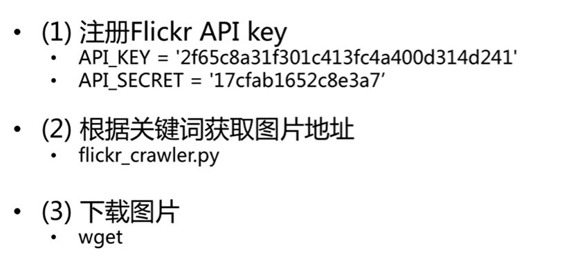
> 特点：不限量，接口文档，可获得百万高质量图片，但速度慢

- 按照用户ID爬取：[https://github.com/hellock/icrawler](https://github.com/hellock/icrawler)
- 专有网站爬虫（摄影）：[https://github.com/darrenfantasy/image_crawler](https://github.com/darrenfantasy/image_crawler)

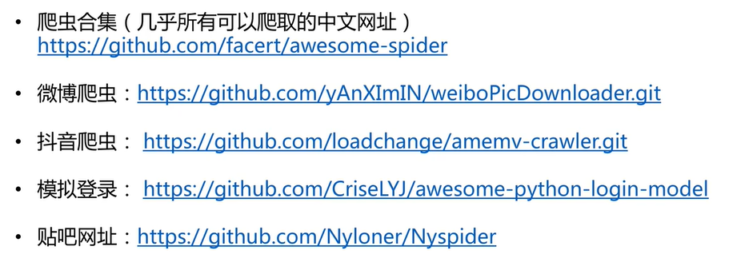

## 数据整理

###  数据检查与归一化

检查图片：
1. 去除坏图（防止读取失败）
2. 尺寸异常长（如长宽比大于10）

格式归一化：
1. 类型归一化（方便遍历，`.jpg`、`.png`，统一压缩方式）
2. 命名归一化（方便归类）

### 数据去重

重复图片类型：
1. 相同图片，名字不同，内容相同
2. 相同图片，大小不同，内容相同
3. 相似图片（连续视频帧、扰动污染（水印等））

去重技术：
- 去除相同的图片-基于MD5（python库-`hashlib`）：[code1](https://blog.csdn.net/mighty13/article/details/77998283) ，[code2](https://blog.csdn.net/shanyu312/article/details/88824954) ...
> 相同图片不管怎么传输，MD5是不会改变的！
- 去除相似的图片-基于图片内容进行判断：一个简单的放法是缩放图片到同样大小，对像素值进行逐个比较（基于绝对差阈值）
> 基于图片的相似度计算的改进：MSE距离，DNN特征相似度，深度学习放大；

> 基于遍历方案的改进：根据相关准则（文件物理大小，图像尺寸，文件名字）进行一个预先排序，搜索一定的深度或最近邻；

### 数据集划分

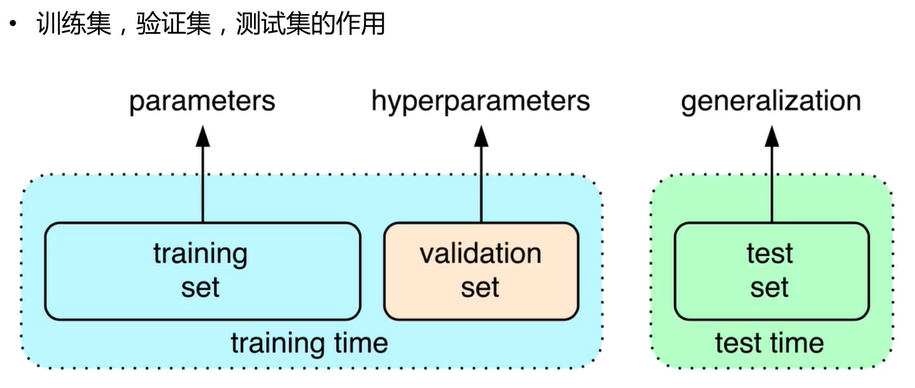

1. 随机打乱数据+划分：
- 常用比例是7：3或者9：1
- 划分模式：随机/均匀
2. 数据集难度划分

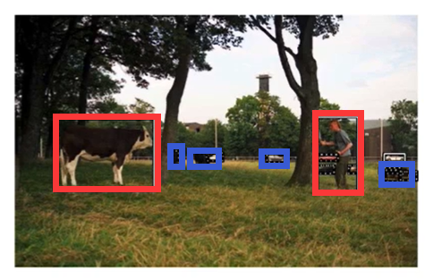
> 红色标注的数据为Easy，而蓝色框标注为Hard，可以分为不同难度的数据集进行使用

> 为什么要划分不同难度等级呢？以人像抠图为例。
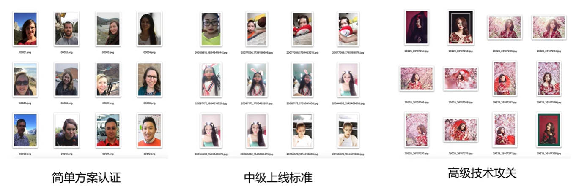

## 数据标注

### 自动数据标注

- EISeg：[https://github.com/PaddleCV-SIG/EISeg](https://github.com/PaddleCV-SIG/EISeg)
- 基于RNN的半监督交互式工具：[https://github.com/fidler-lab/polyrnn-pp-pytorch](https://github.com/fidler-lab/polyrnn-pp-pytorch)
- 基于GCN的半监督交互式工具：Curve-GCN

## 数据增强

做任务到底需要多少数据？
1. 任务类型有关，越精细任务要求越多
2. 任务难度有关，在ImageNet中每类约500个，Place365中每类约5000个
3. 精度要求有关，学术任务？工业级产品？

如何增加模型的泛化能力？
1. 显式正则化（如模型集成、参数正则化等）
2. 隐式正则化（如数据增强、随机梯度下降等）

什么是数据增强？

数据增强（Data Augmentation）也叫数据扩增、数据增广，意思是在不实质性的增加数据的情况下，从有限数据产生更多变种，让有限的数据产生等价于更多数据的价值。
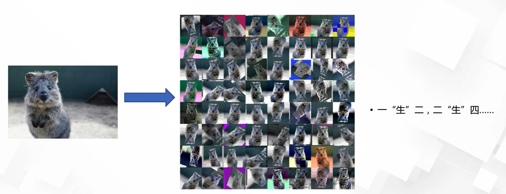

为什么要做数据增强？

1. 数据增强：可以大幅度降低数据采集成本
2. 提高模型的泛化能力

### 基本数据增强方法

基本的数据增强，采用固定的预设规则进行数据扩增，包括单样本数据增强和多样本数据增强：
1. 单样本增强：几何操作类和颜色操作类；
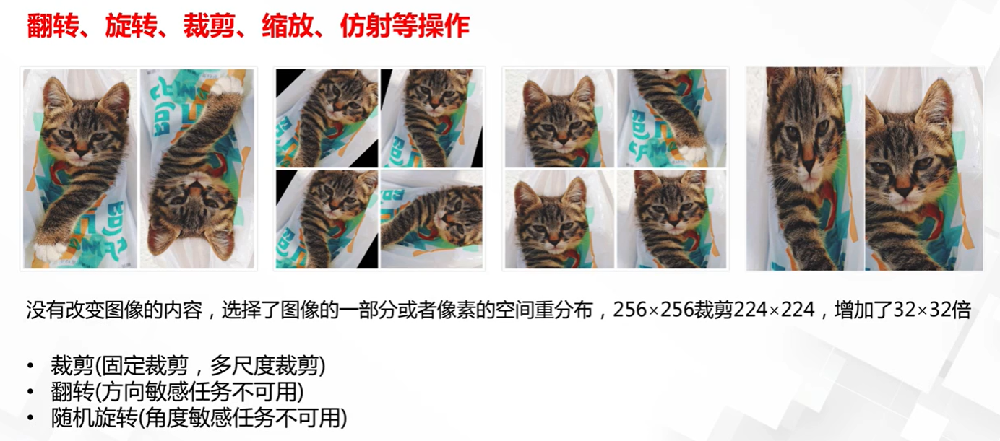
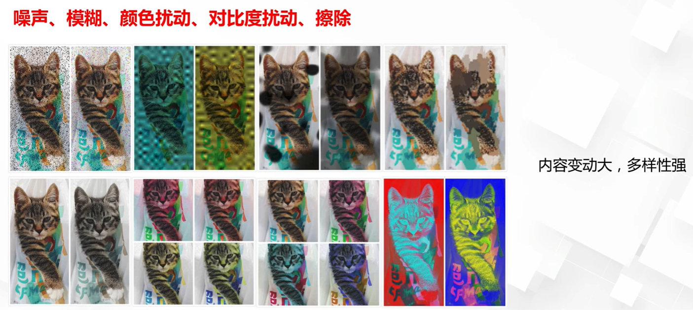
2. 多样本增强：离散样本点连续化来进行插值拟合；

SMOT：


SamplePairing：
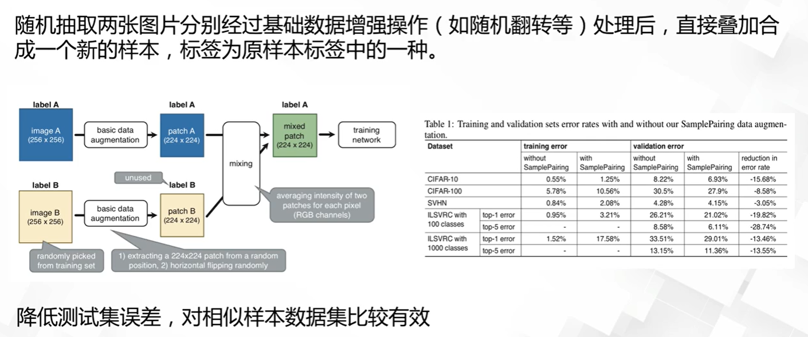

Mixup：
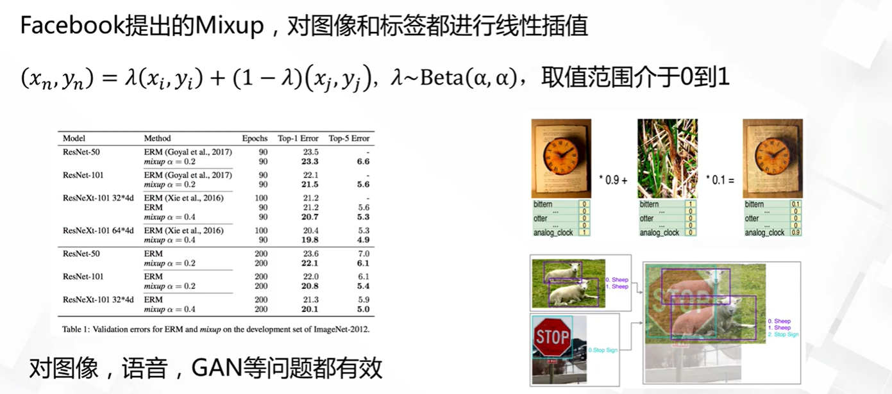

3. 综合变换

[https://github.com/aleju/imgaug](https://github.com/aleju/imgaug)

特定领域图像的数据增强：
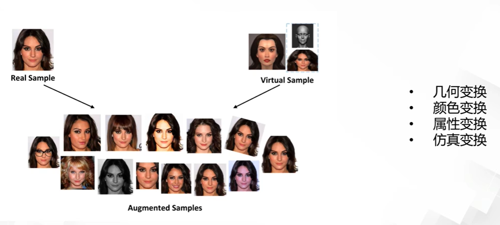

### 自动数据增强方法

> 所谓自动增强方法就是让算法来选择数据增强！

例如Google提出的`Autoaugment`框架的流程是这样的：
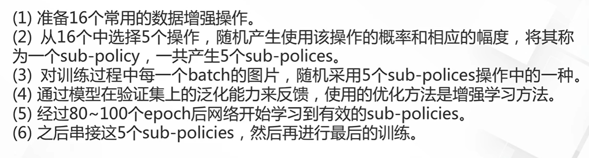

`Autoaugment`的数据增强操作：
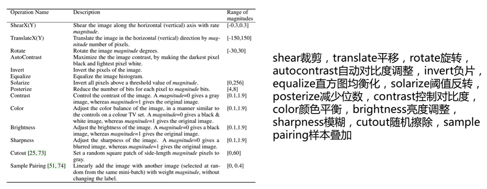

### 从零生成新的数据

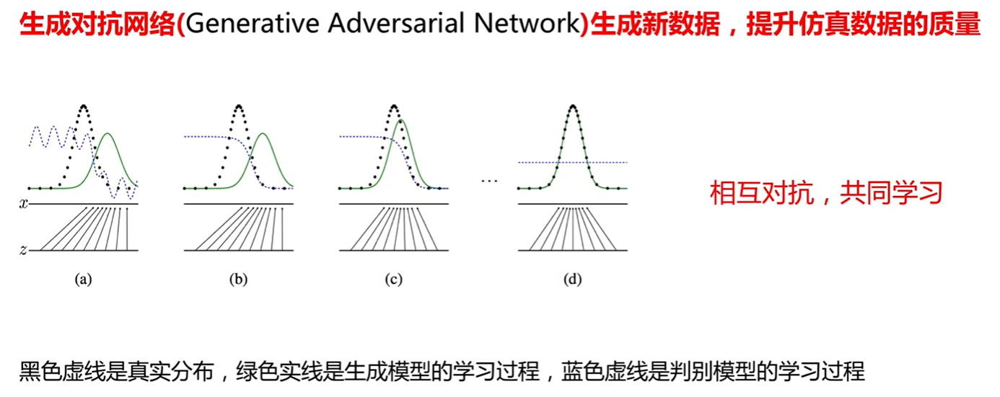
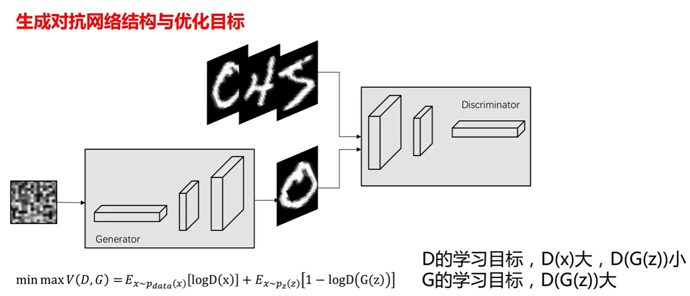
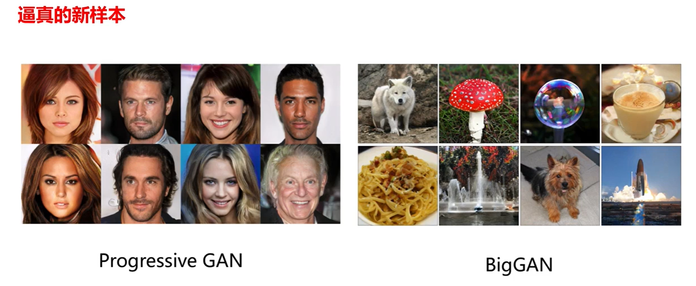

### pytorch数据增强介绍

pytorch数据增强接口：pytorch通过torchvision包读取已有的数据集，以及进行视觉任务的数据增强。
```python
pip install torchvision
```
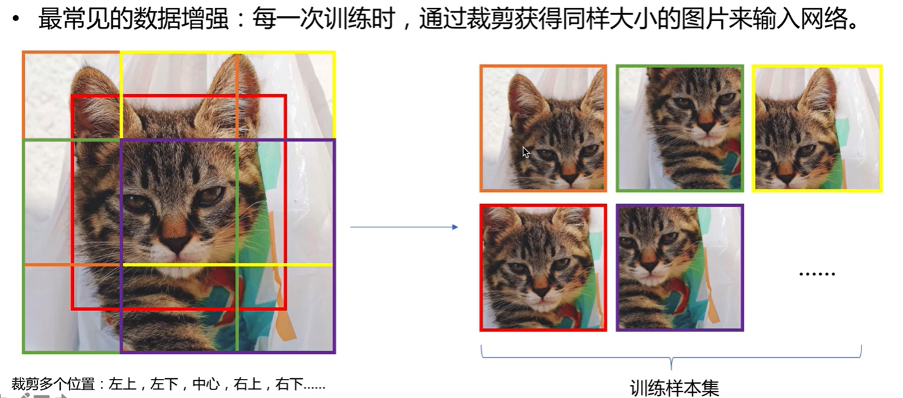

数据预处理：
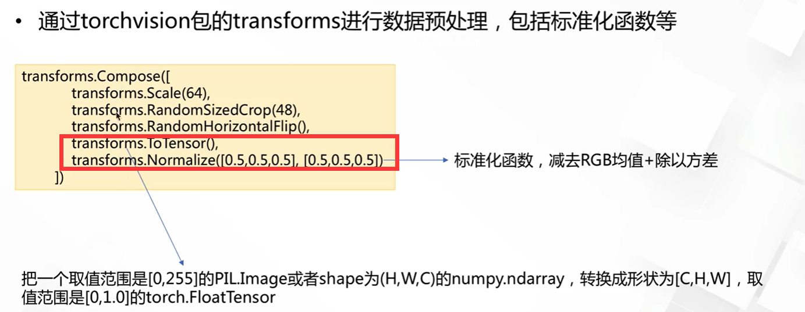

数据增强：
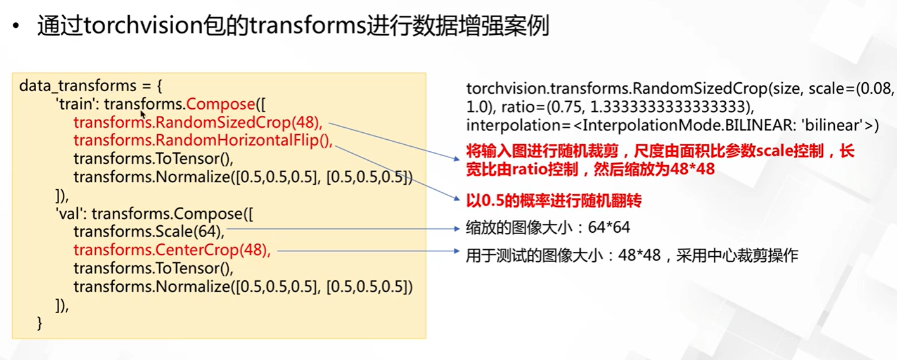

> 在torchvision的transforms中包括数据预处理的数据增强两部分！

> 在数据的测试中通常是不用包含数据增强操作的，所以在测试的transfroms中一般是裁剪、缩放、totensor等这种操作

常见的数据预处理和增强的操作：
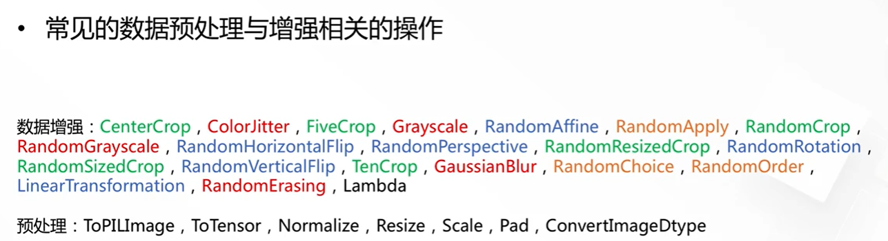

自定义数据增强操作：
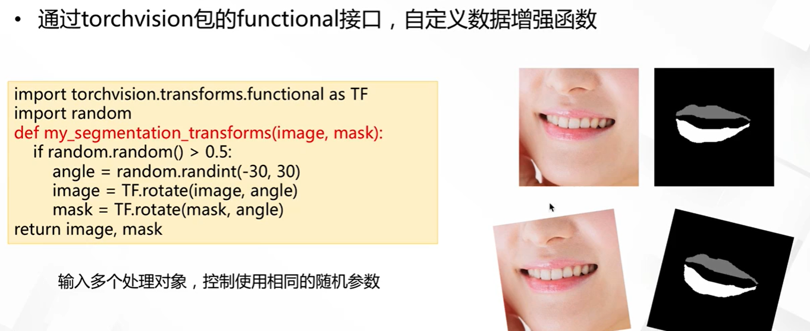

### pytorch数据增强实践

### 数据增强开源库imgaug

[https://github.com/aleju/imgaug](https://github.com/aleju/imgaug)

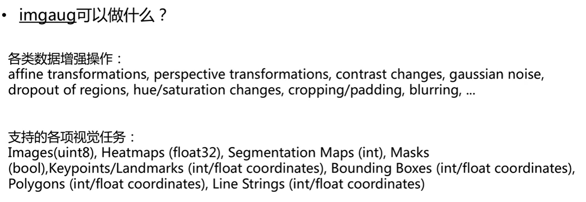

### 数据增强开源库imgaug实践


